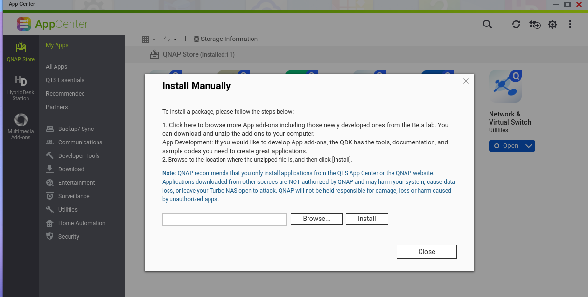
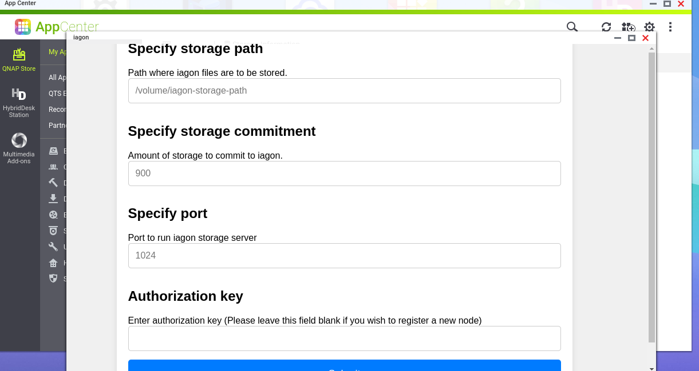

# Node-Qnap

This is the repository for Node-Qnap. Run the following command to generate a build: ``` qbuild ``` <br/>
Info: (Optionally, for developers to check.

## Pre-installation

- Visit `some-link` to download the installation package for your NAS platform.


## Installation

### Step 1 Login Step
- Log in to QutsHero or the QNAP application.


### Step 2 Manual Install
- Manually install the QNAP application.

Note: Download the IAGON (.qpkg) package from the link provided above.

a. On the top left side, you'll find a button for manual installation. Click on it.



b. Browse Files from Directory.


c. Install File  


### Step 3 Installation Wizard 

a. Open the Qnap App after installation.


b. Fill out the Form.
Note: The directory you mentioned should be valid.


    

### Step 4 Auth-Key Reminder
- Once installed, you'll be prompted with the auth-key after installation. Make sure to save the authorization key in a safe place.

<br/>
Note: If you do not see your auth key here, you can also regenerate it.

a. If the iagon-node shows as stopped, you can start it manually. To do so, click on the start button at the top left.
  

### Step 5 Regenerate Auth Key
a. Click on the `Auth Key` Button. <br/>


b. Click on to Regenerate Authorization Key.
Then, you can see your auth Key <br/>


c. If your node is already verified, then click "Continue" to proceed to the application.


    
### Step 6 Restart Option
- In some circumstances, you may need to restart. In this case, you can use the "Restart" button.
- This can also be useful if something failed during installation


### Step 7 Node Stop
- You can stop the node by clicking on the "Stop" button in the options.
a. To stop the iagon node, Click on the stop button. <br/>


b. You can also stop the node by simply right-clicking on it and selecting "Stop Node."<br/>


### Step 8 Application Removal
- You can also remove the application by selecting the "Remove" option.


     
     


